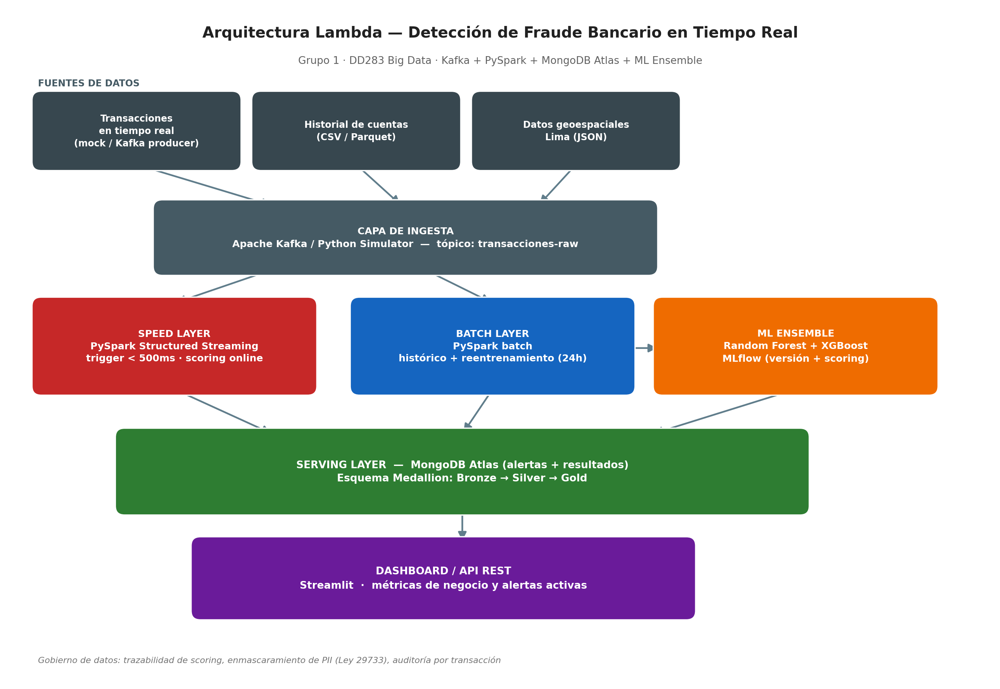

# Grupo 1 — Detección de Fraude Bancario en Tiempo Real

**Real-Time Fraudulent Transaction Detection in Latin American Digital Banking Using Lambda Architecture, Apache Kafka and Ensemble Learning: A Scalable Big Data Framework**

*Sistema de Detección de Fraude Bancario en Tiempo Real mediante Arquitectura Lambda y Aprendizaje de Máquina Ensemble*

DD283 — Big Data · Cycle VIII · 2026-1

## Problema
Los bancos digitales peruanos (BCP, Yape, Interbank, Scotiabank) procesan más de 2 millones de transacciones diarias. Hoy el scoring de fraude corre en batch cada 24h, las alertas llegan con 15 minutos de retraso y la tasa de falsos positivos ronda 12%, bloqueando clientes legítimos. Las pérdidas estimadas por fraude no detectado superan S/ 850 millones/año (SBS, 2024).

Este proyecto diseña e implementa un pipeline Big Data end-to-end que detecta transacciones fraudulentas con **latencia < 500ms**, **precisión > 85%** y **tasa de falsos positivos < 5%**, combinando procesamiento streaming (Speed Layer) y batch (Batch Layer) sobre una **Arquitectura Lambda**.

## Arquitectura


Ver justificación completa (Lambda vs. Kappa) y stack tecnológico en el caso de negocio del curso.

## Estado del proyecto

| Semana | Entregable | Estado |
|---|---|---|
| S1 | EDA + dataset sintético + diagrama de arquitectura | ✅ |
| S2 | Pipeline Pandas/Batch (Capa Bronze, Silver, Gold) | ✅ |
| S3 | MongoDB Atlas + patrones NoSQL | ⬜ |
| S4 | Evaluación Parcial (EP) | ⬜ |
| S5 | Spark SQL + features avanzadas | ⬜ |
| S6 | Modelo ML (Random Forest entrenado) | ✅ |
| S7 | Scraping + calidad de datos | ⬜ |
| S8 | Evaluación Final (EF) | ⬜ |

## Estructura del repositorio

grupo1-fraude-bancario-bd/
├── notebooks/
│   └── 01_EDA_transacciones.ipynb     ← Semana 1
├── src/
│   ├── simulador_transacciones.py     ← Generador de datos sintéticos
│   ├── pipeline_bronze.py             ← Ingesta segura capa Bronze (Safe Mode)
│   ├── pipeline_batch.py              ← Procesamiento capas Silver y Gold
│   ├── train_model.py                 ← Entrenamiento y evaluación del modelo ML
│   ├── build_eda_notebook.py          ← Construye el notebook de EDA
│   └── build_arquitectura_diagram.py  ← Genera el diagrama de arquitectura
├── data/
│   ├── sample/                        ← Muestra pequeña (2,000 filas)
│   ├── bronze/                        ← Datos crudos almacenados
│   ├── silver/                        ← Datos limpios y depurados
│   └── gold/                          ← Datos enriquecidos con features de fraude
├── docs/
│   └── arquitectura_lambda.png
└── requirements.txt

## Reporte Técnico de Implementación

**Alumno Desarrollador:** Noe Paredes Hilario  
**Entorno de Ejecución:** Entorno Virtual de Python (`venv`) en Windows  

### 1. Arquitectura de Datos (Medallion Architecture)
Para mitigar las restricciones de entornos locales y dependencias de Java/Hadoop, el procesamiento de datos se estructuró de manera eficiente utilizando la librería Pandas, garantizando la escalabilidad local de los flujos:

* **Capa Bronze (`pipeline_bronze.py`):** Ingesta segura de datos crudos (Safe Mode). Lee el origen CSV y genera la persistencia estructural sin alteraciones en el almacenamiento local.
* **Capa Silver (`pipeline_batch.py`):** Control de calidad. Elimina duplicados basados en `transaccion_id`, depura registros con valores nulos en campos críticos (`usuario_id`, `monto`) y realiza el correcto tipado de fechas.
* **Capa Gold (`pipeline_batch.py`):** Ingeniería de características (Feature Engineering). Enriquecimiento analítico mediante reglas lógicas de negocio contextualizadas en el comportamiento financiero peruano:
  * `es_madrugada`: Transacciones efectuadas en el rango crítico de 1:00 a.m. a 5:00 a.m.
  * `yape_plin_alto`: Operaciones mediante billeteras digitales rápidos (Yape/Plin) que superen los S/. 400.
  * `fin_de_semana`: Identificación de operaciones en días sábados y domingos.

### 2. Entrenamiento y Evaluación del Modelo (Semana 6)
Se implementó un algoritmo supervisado de clasificación **Random Forest (Bosque Aleatorio)** a través de `scikit-learn`. Se incorporaron técnicas de balanceo de peso por clase (`class_weight='balanced'`) debido a la naturaleza desbalanceada del fraude bancario.

#### Importancia de las Variables (Feature Importance)
El modelo entrenado arrojó la siguiente distribución de relevancia de impacto para la toma de decisiones:
1. **`monto`**: 31.25% - Principal indicador de anomalía financiera.
2. **`distancia_km_home`**: 24.55% - Distancia física significativa entre la ubicación de la TX y el domicilio.
3. **`hora_dia`**: 18.76% - Franja horaria de la operación.
4. **`yape_plin_alto`**: 6.23% - Impacto directo de la regla de negocio para canales digitales rápidos.
5. **`tx_ultimos_15min`**: 5.25% - Frecuencia y ráfagas de transacciones consecutivas.
6. **`comercio_nuevo`**: 2.07% - Operaciones en establecimientos sin historial previo.
7. **`es_madrugada`**: 1.79% - Peso específico del horario nocturno de alto riesgo.
8. **`fin_de_semana`**: 1.44% - Factor temporal estacional.

## Cómo ejecutar el Pipeline Completo
Para correr toda la arquitectura de datos y reentrenar el modelo de Machine Learning de corrido de forma local, ejecuta los siguientes comandos en tu terminal:

```bash
# 1. Crear el dataset de simulación de transacciones
python src/simulador_transacciones.py

# 2. Ejecutar la ingesta a la capa Bronze
python src/pipeline_bronze.py

# 3. Procesar las transformaciones de las capas Silver y Gold
python src/pipeline_batch.py

# 4. Entrenar y evaluar el modelo predictivo de fraude
python src/train_model.py

### Paso 3: Guardar y Ver
1. Presiona **`Ctrl + S`** para asegurar que todo quede guardado.
2. Presiona **`Ctrl + Shift + V`** para abrir la vista de previsualización.